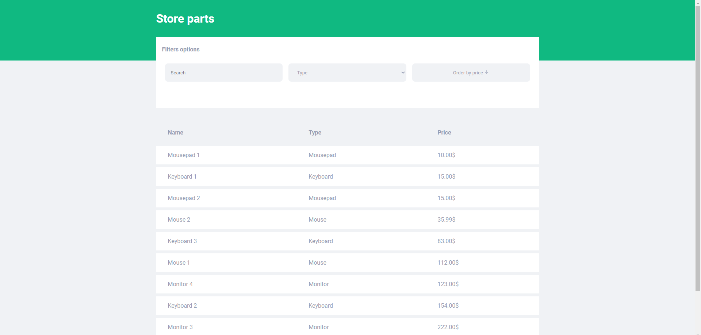

# SPA-STORE-PARTS

This is a Single Page Aplication made as an exersices proposal for a store parts. This project have two functionalities which is list all store parts and show one store part details.



### Built With

The project was built with:

-   [Create React App](https://create-react-app.dev/)
-   [TypeScript](https://www.typescriptlang.org/)
-   [Styled Components](https://styled-components.com/)
-   [React Icons](https://react-icons.github.io/react-icons)

## Getting Started

For run this project you must have [Node.js](https://nodejs.org/en/) installed and have authorization for clone the REST API which is the Backend for this App.

Now clone this project and then follow the commands below to run it.

1. Move into project folder

```
cd spa-store-parts
```

2 . Install dependences

```
yarn
```

or

```
npm install
```

3. Run app

```
yarn start
```

or

```
npm run start
```

After that, you must have the project running at

```
http://localhost:3000/
```
